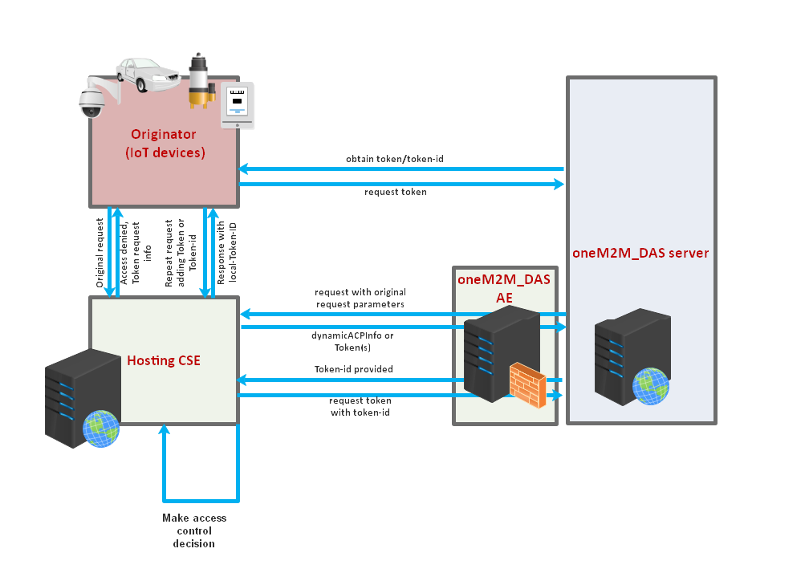

# oneM2M_DAS
## Introduction

oneM2M_DAS platform is a oneM2M compliant IoT Dynamic Authorization System server platform designed to offer a flexible access control decision mechanism for accessing resource from IoT application and devices. Figure 1 shows the architecture of DAS platform structured with oneM2M entities and reference points.

<div align="center">

</div>

<div style="text-align:center">Figure 1 oneM2M complied oneM2M_DAS platform architecture</div>

oneM2M_DAS platform provides a series of REST APIs for protocol HTTP to realize dynamic access control mechanism between IoT applications and devices through IN-CSE as shown in Figure2. APIs for creation and retrieval of oneM2M resources and access control policies are also provided to simplify the procedures of authorization management.

<div align="center">

</div>

<div style="text-align:center">Figure 2 Interconnection between oneM2M_DAS and IoT applications/devices and IN-CSE</div>

## oneM2M_DAS Platform

### Introduction

oneM2M_DAS is a middleware server platform that stores virtual representations (of oneM2M targeted resources) and access control policy for each resource to enable the dynamic authorization system for IoT devices and applications.  Figure 3 shows the components of oneM2M_DAS platform, i.e. IoT applications/devices, IN-CSE, and oneM2M_DAS Server/oneM2M_DAS AE.

<div align="center">

</div>

<div style="text-align:center">Figure 3 oneM2M_DAS server platform components</div>

The oneM2M_DAS server platform can be implemented using diverse programming languages and the oneM2M_DAS is developed using Node JS. In addition, oneM2M_DAS uses Node JS express modules which provides diverse modules for developers including HTTP instead of Node JS express framework.
The oneM2M_DAS server platform is compliant to oneM2M standards and supports HTTP bindings specified also in oneM2M standards. The oneM2M_DAS server platform implements oneM2M Dynamic Authorization System server with structured resource architectures and access control policy info providing authorization decision function through RESTful APIs. The oneM2M_DAS server platform uses MySQL DBMS for resources and access control policy and access token storage.

### Functionalities

oneM2M_DAS Server will provide the following functionalities to realize the dynamic authorization system for resource access requests from IoT applications and devices. 

- Manage resource (mainly AE,container) info stored in IN-CSE

- Manage ACP info related to a specific resource for an Originator (IoT application or device)

- Receive access control info/tokenid/roleid from IN-CSE/Originator and Response to IN-CSE/Originator with generated access control policy info/granted permission info or access token. Adhering to oneM2M DAS specific protocol to communicate with IN-CSE

- Manage access token information

- Support JWT for secure communication (ESData function)

The call flows as shown in Figure 4 indicates the communications and interactions among devices, IoT applications, IN-CSE and oneM2M_DAS.

<div align="center">

</div>

<div style="text-align:center">Figure 4 oneM2M_DAS interaction with IoT devices, applications, and IN-CSE</div>

### Components

oneM2M_DAS server consists of HTTP server and MySQL DBMS while IoT applications implement HTTP clients in order to communicate with oneM2M_DAS server directly or indirectly via IN-CSE.

<div align="center">

</div>

<div style="text-align:center">Figure 5 oneM2M_DAS platform components</div>

### S/W Architecture

For protocol binding support, oneM2M_DAS has HTTP server internally.  Mainly it consists of requester and responder. The requester contains the DB access component. Every HTTP request is go through requester component, parser, actor and then create SQL query to data access (e.g. retrieval, discovery) with DB connector. When it gets access result, the responder creates the response in JSON serialization.

<div align="center">

</div>

<div style="text-align:center">Figure 6 oneM2M_DAS platform S/W architecture</div>

### Source Code Directory

The figure below shows the oneM2M_DAS Node JS source directory. For the detailed functions and
roles for each Node JS file, please refer to the Table 1.

```
(das home directory)
   │─ app-ae.js
   │─  app.js
   │─  conf-ae.json
   │─  conf.json
   │─  das-ae.js
   │─  dasserver.js
   │─  package.json
   │─  README.md
   │─  server-crt.pem
   │─  server-key.pem
   └─das (directory)
        │─ dasdb.sql
        │─ db_action.js
        │─ resource.js
        │─ responder.js
        │─ sql_action.js
        │─ time-check.js
        └─ token.js
```

<div style="text-align:center">Figure 7 oneM2M_DAS Node JS source code directory</div>

The reference table below shows the role and function of provided Node JavaScript based files.

<center>Table 1 Function Reference Table for Node JS Files</center>

| Source File       | Role and Function                                            |
|:---|:---|
| app.js            | This file acts as role of flow router and it is the main code running oneM2M_DAS server.<br>① It handles initial processing of received packets.<br>② It initiates HTTP server with ‘listening’ mode to wait for HTTP requests target to the oneM2M_DAS HTTP server.<br>③ It handles the parsing of URL of packets and evaluate the correctness of the request body resulted of parsing. It then sends the request to resource.js to continue the processing if the request is valid one, otherwise throws exceptions.<br>④ It also contains the logic for checking access control information received from IN-CSE to generate and send back temporal access control policy or granting permission. |
| app-ae.js         | This file acts as role of flow router and it is the main code running oneM2M_DAS AE.<br>① It handles initial processing of received packets.<br>② It initiates HTTP server with ‘listening’ mode to wait for HTTP requests target to the oneM2M_DAS AE HTTP server.<br>③ It handles the parsing of URL of packets and evaluate the correctness of the request body resulted of parsing. If the request is targeted to oneM2M_DAS Server, it forwards the request to oneM2M_DAS Server. It works like a proxy server between IN-CSE and oneM2M_DAS server.<br>④ It registers itself to IN-CSE to enable a trusted communication. |
| dasserver.js      | This file initiates oneM2M_DAS server and helps loading main Node JS files.<br>It also contains configuration parameters for oneM2M_DAS server such as defaultbodytype indicating the serialization, usecsebase<br/>indicating CSEBase name, usecseid indicating CSEID, usedbhost indicating the host address running MySQL, and usedbpass indicating the password for MySQL etc. Users can modify those configuration parameters. |
| das-ae.js         | This file initiates oneM2M_DAS AE and helps loading main Node JS files.<br>It also contains configuration parameters for oneM2M_DAS AE such as  usecsebase indicating CSEBase name, usecseid indicating CSEID etc. Users can modify those configuration parameters. |
| das/db_action.js  | This file contains parameters used to connect and access to the database and parameters for returning response results from the database. |
| das/resource.js   | It is core file to process the CREATE, RETRIEVE, UPDATE, DELETE, NOTIFY operations for oneM2M resource primitives, access control info, and tokens.<br>This file undertakes the processing of parsed request URI and request body received from app.js according to corresponding operation. It converts the data into a format to process the data and connect to mysql database.<br>The mysql database is initialized and handled by db_action.js and sql_action.js module. |
| das/responder.js  | It is responsible for handling the response process.<br>It receives processing results from app.js and resource.js modules and generates responses from the processing results in JSON serialization format. |
| das/sql_action.js | This file contains functions to receive data and parameters required for a series of database operations and functions to call db_action.js module to return data from database. |
| das/time-check.js | This file contains functions to realizing the time-window based access control mechanism. |
| das/token.js      | This file contains functions to generate and store access tokens. |

### Access Control determining logic
In oneM2M spec, oneM2M_DAS checks the access control information received from IN-CSE to dynamically authorize the access request from IoT application, devices (i.e. request originator) targeted to the resource stored in IN-CSE.  The following info can be included in these access control information.

- request originator (mandatory)
- request operation (mandatory)
- ip address (v4 or v6) of request originator (optional)
- timestmap when the request has been received from request originator at IN-CSE (optional)
- location of the request originator (optional)

Although oneM2M spec does not clearly specify how to use these information, our software implements  sample logics to handle these information as followings:

When these information are included in the dynamic authorization request received from IN-CSE, oneM2M_DAS Server will retrieve the access control policy (ACP) of requested target resource and request originator which is stored in the Auth info repository of oneM2M_DAS, then compare each access control information with the related item of retrieved ACP. 

- If request originator and operation does NOT match to/allow with the retrieved ACP info, the request will be rejected and Error is returned. 
- If any of optional information does NOT match to/included in allowed ip address(es) or NOT fall into the range of time-window or circle region or the NOT matched to the list of allowed country code(s) of the retrieved ACP, then request will be rejected and response with no error and empty access control policy data will be sent back. 
- In other case,  the original request is allowed and a temporal access control policy information or granted permission using dynamicACPinfo or access token will be returned. Then IN-CSE will make a final access control decision by using the received info . 

### API list

oneM2M_DAS is providing Restful API to manage the resource and ACP info, and dynamic authorization function.  Table 2 shows the supported list of APIs.

<center>Table 2 API lists</center>

| Functionality       | URI  |  Method |
|:-----------------|:-------------|:------|
| dynamic Authorization|das/dynaAuth	|POST|
| create resource|das/rce	|POST|
| retrieve resource|das/rce/_/{resource_uri}|	GET|
| update resource	|das/rce/_/{resource_uri}|	PUT|
| delete resource	|das/rce/_/{resource_uri}|	DELETE|
| retrieve resource list|das/rceList|	GET|
| create ACP|	das/acp|	POST|
| retrieve ACP| 	das/acp|	GET|
| update ACP|	das/acp	|PUT|
| delete ACP|	das/acp|	DELETE|
| retrieve ACP list|	das/acpList|	GET|
| create token| das/token|	POST|

# oneM2M_DAS Server Platform Installation

## oneM2M_DAS install procedure ( Azure Ubuntu Server 18.04 LTS )

oneM2M_DAS is constructed with Node JS and MySQL and consequently support multi OS platform including Linux, Windows, Mac.  In this install manual, we just describe how to install oneM2M_DAS on Azure Ubuntu Server 18.04.  For  installation procedure on any other environment, please refer Node JS and MySQL official installation guide.

## 1.MySQL
```
$ sudo apt update
$ sudo apt install mysql-client
$ sudo apt install mysql-server
$ sudo service mysql start
```

## 2.Node.js
### 2.1 nvm install
```
git clone https://github.com/creationix/nvm.git ~/.nvm
source ~/.nvm/nvm.sh
```

### 2.2 node install (ver12.9.0 or later)
```
$ nvm ls-remote
$ nvm install 12.9.0
$ node -v
v12.9.0
```

## 3.oneM2M_DAS Server
### 3.1 oneM2M_DAS Install

```
$ cd ~/
$ git clone https://github.com/IoTKETI/oneM2M_DAS.git
$ cd DAS/
$ npm install
```

### 3.2 Import data into mysql

```
$ mysql -u root -p
mysql> create database dasdb;
mysql> exit

```
Import data into dasdb database
```
$ mysql -u root -p dasdb < ~/DAS/das/dasdb.sql
```

### 3.3 Configure DAS setup file

```
$ sudo vi ~/DAS/conf.json
```

dasbaseport is the service port number for DAS server

```
{
	"dasbaseport": Port number of DAS server
	"dbpass": Password to access mysql
}

(sample)
{
	"dasbaseport": "7580"
	"dbpass": "password"
}
```

### 3.4 Start oneM2M_DAS server

```
$ node dasserver.js
Start DAS server!
Connecting to mysql!
das server (http) (10.0.75.1) running at 7580 port
```

### 3.5 Starting DAS in background

```
$ nohup node dasserver.js &
```

## 4. DAS-AE

### 4.1 Configure DAS-AE setup file

```
$ sudo vi ~/DAS/conf-ae.json
```

dasaebaseport is the service port number for DAS-AE module

```
{
    "dasaebaseport": Port number of DAS-AE module
}

(sample)
{
    "dasaebaseport": "7581"
}
```

### 4.2 Configure CSE/DAS info
```
$ sudo vi ~/DAS/das-ae.js
```


```
// oneM2M_DAS information
 global.usedashost	    = 'localhost';
 global.usedasport	    = '7580';

// CSE information
 global.usecsehost      = 'ocean.local.com';
 global.usecseport      = '7579';
 global.usespid         = '//sample.a';
 global.usecseid        = '/mb-cse-a';
 global.usecsebase      = 'mb-base-a';
```


### 4.3 Start oneM2M_DAS AE module

```
$ node das-ae.js
Start DAS-AE!
DAS-AEID= SxOdKDLb9ty
das-ae (http) (10.0.75.1) running at 7581 port
```

4.4 How to setup oneM2M_DAS AE resource in IN-CSE


## Testing tools

[SwaggerEditor](https://editor.swagger.io/)

[YAML file for SwaggerEditor]()

[Postman](https://www.getpostman.com/)
[End]

